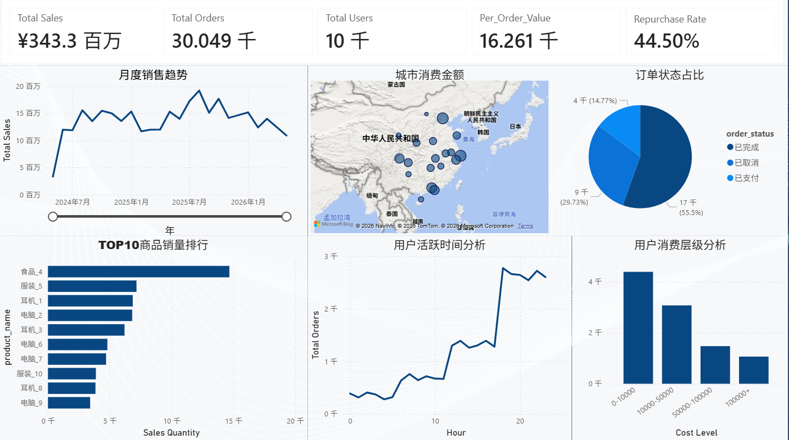
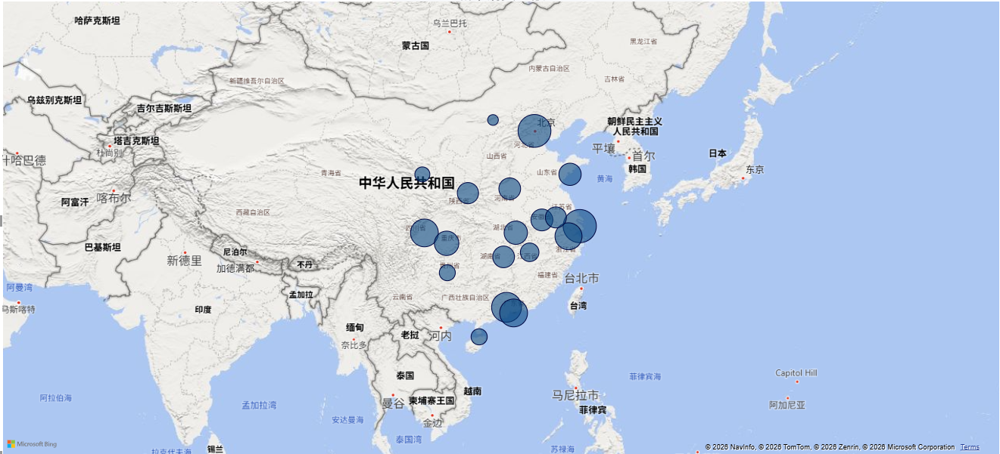
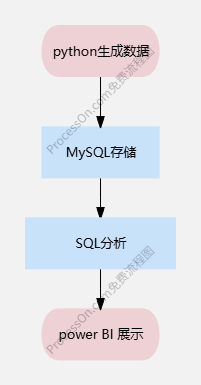

# 电商订单分析与可视化平台

## 项目介绍

基于 Python + MySQL + Power BI 构建电商订单分析平台，
通过模拟真实电商业务数据，
完成订单分析、用户消费分析、
城市消费能力分析、热门商品分析、
用户复购分析等业务场景。

## Power BI Dashboard

## Tech Stack

- Python
- Pandas
- Faker
- MySQL
- SQL
- Power BI
- Git

## 项目架构

## 数据建模逻辑

# 用户分层

- 44% 用户低频消费（10000以下）
- 45% 用户中频消费（10000-100000）
- 11% 用户高活跃消费（100000+）

# 城市消费能力

一线城市消费能力更高，
通过 price_multiplier 模拟不同城市消费水平差异。

# 热门商品机制

通过权重抽样模拟头部商品效应，
形成明显销量集中现象。

# 时间规律

模拟晚间消费高峰，
18:00~23:00订单量明显增加。

## SQL Analysis

# 热门商品分析
SELECT
	p.product_name,
	SUM(oi.quantity) AS sales_qty
FROM order_items oi
JOIN products p
ON oi.product_id = p.product_id
GROUP BY p.product_name
ORDER BY sales_qty DESC
LIMIT 10;

# 用户复购分析

SELECT 
    -- 分子：统计下了 2 单及以上已完成订单的用户数
    COUNT(DISTINCT CASE WHEN finish_cnt > 1 THEN user_id END) AS repeat_users,
    -- 分母：总消费用户数
    COUNT(DISTINCT user_id) AS total_users,
    -- 复购率
    CONCAT(
    	ROUND(
        	COUNT(DISTINCT CASE WHEN finish_cnt > 1 THEN user_id END) / COUNT(DISTINCT user_id) * 100,
        	2
    	),
    	'%'
    ) AS repurchase_rate
FROM (
    SELECT 
        user_id, 
        -- 针对每个用户计算已完成订单数
        SUM(CASE WHEN order_status = '已完成' THEN 1 ELSE 0 END) AS finish_cnt
    FROM orders
    GROUP BY user_id
) user_order_summary;

# 城市消费分析
SELECT
	u.city,
	SUM(o.total_amount) AS total_sales
FROM orders o
JOIN users u
ON o.user_id = u.user_id
WHERE o.order_status != '已取消'
GROUP BY u.city
ORDER BY total_sales DESC;

# 用户活跃时间分析
SELECT
	HOUR(order_date) AS hour,
	COUNT(*) AS order_count
FROM orders
GROUP BY hour
ORDER BY hour;

## 数据分析结论

- 一线城市消费金额明显更高
- 晚间为订单高峰时段
- 商品销量存在明显头部集中现象
- 用户复购率约44.5%
- 已完成订单占比最高

